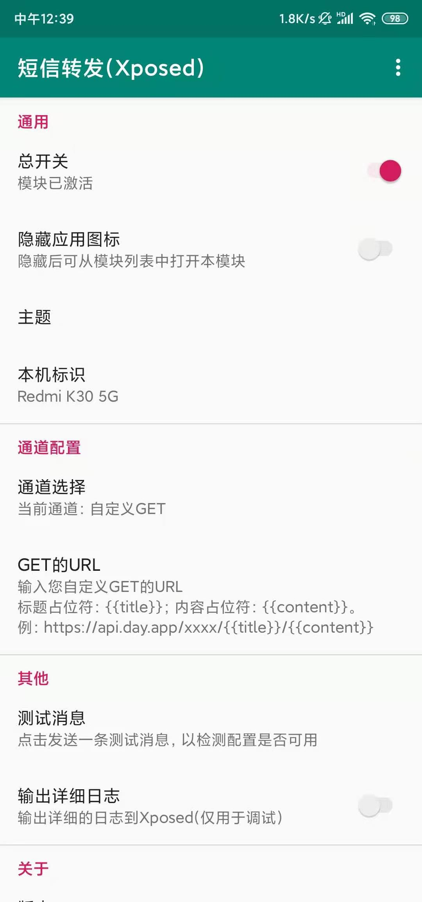
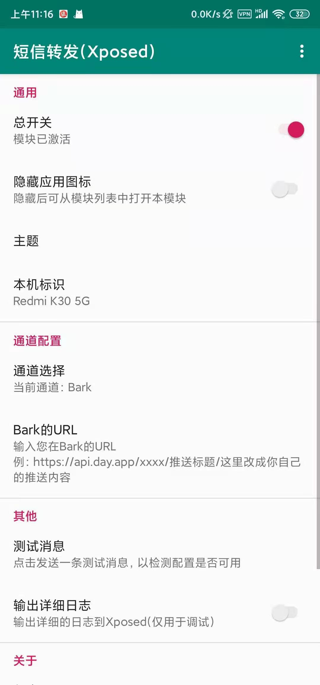

# XposedForwardSms
转发短信的Xposed模块，收到短信时自动发起请求，将短信内容通过http请求发送出去，便于在另一个手机上接收。
项目参考自[XposedSmsCode](https://github.com/tianma8023/XposedSmsCode)。

# 应用截图

# 使用
1. Root你的设备，安装Xposed框架；
2. 安装本模块，激活并重启；
3. 欢迎反馈，欢迎提出意见或建议。

# 注意
- **预期兼容性：兼容 Android 6.0 及以上（api等级≥23）设备。**
- **预期支持：LsPosed、EdXposed、太极·magisk**
- **本人仅使用RedmiK30 5G手机在crDroid及MIUI系统使用LsPosed, EdXposed测试通过。**

# 功能
- 收到短信后将短信转发
- 主题换肤

# 配置教程（更新中）
- [Bark（仅IOS接收）](/tutorial/bark.md)
- [钉钉](/tutorial/dingtalk.md)
- [企业微信应用消息](/tutorial/workWeixin.md)

# 自定义GET/POST配置示例
### 引用变量：
    标题：{{title}}
    内容：{{content}}

### WXPusher示例如下：
    GET网络地址：http://wxmsg.dingliqc.com/send?title={{title}}&msg={{content}}&userIds=你的ID

### Server酱示例如下：
    GET网络地址(旧版)：https://sc.ftqq.com/SCKey.send?text={{title}}&desp={{content}}
    GET网络地址(新版)：https://sct.ftqq.com/SCKey.send?text={{title}}&desp={{content}}

### bark「iOS」示例如下：
    GET网络地址：https://api.day.app/你的key/{{title}}/{{content}}

### 钉钉机器人示例如下(使用关键字方式，添加【来自】)：
    POST网络地址：https://oapi.dingtalk.com/robot/send?access_token=你的key
    POST的body：{"msgtype": "text","text": {"content": "{{title}}\n{{content}}"}}

### 飞书机器人示例如下(使用关键字方式，添加【来自】)：
    POST网络地址：https://open.feishu.cn/open-apis/bot/v2/hook/你的key
    POST的body：{"msg_type":"post","content":{"post":{"zh_cn":{"title":"{{title}}","content":[[{"tag":"text","text":"{{content}}"}]]}}}}

### 企业微信群机器人示例如下：
    POST网络地址：https://qyapi.weixin.qq.com/cgi-bin/webhook/send?key=你的key
    POST的body：{"markdown":{"content":"### {{title}} \n{{content}}"},"msgtype":"markdown"}n{{content}}"},"msgtype":"markdown"}

# 更新日志
[更新日志](/LOG-CN.md)

# 感谢
- [XposedSmsCode](https://github.com/tianma8023/XposedSmsCode)
- [MMKV](https://github.com/Tencent/MMKV)

# 协议
所有的源码均遵循 [GPLv3](https://www.gnu.org/licenses/gpl-3.0.txt) 协议