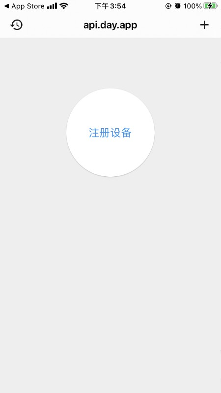
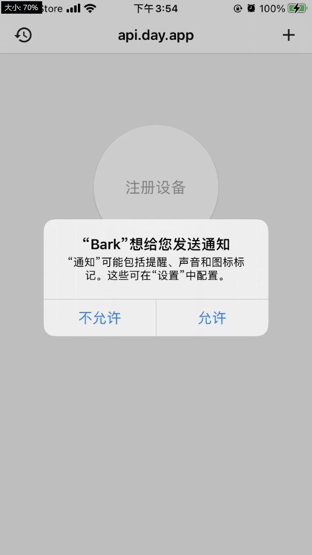
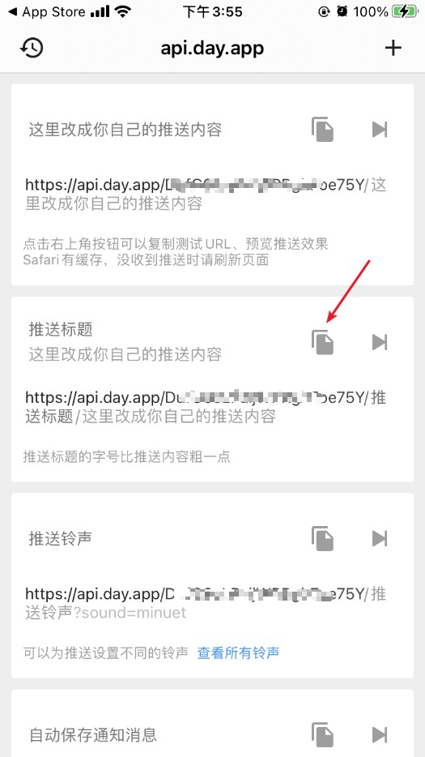

# Bark配置说明（仅IOS接收）

## 流程

 1. 下载Bark
 2. 注册设备，获取Bark的URL
 3. 配置通道

#### 第一步：下载Bark

app store搜索下载Bark，或者[点此](https://apps.apple.com/cn/app/bark-%E7%BB%99%E4%BD%A0%E7%9A%84%E6%89%8B%E6%9C%BA%E5%8F%91%E6%8E%A8%E9%80%81/id1403753865)

#### 第二步：注册设备，获取Bark的URL
点击按钮注册

允许发送通知

复制第二个链接

#### 第三步：配置通道
通道选择【Bark】，填入获取的url

