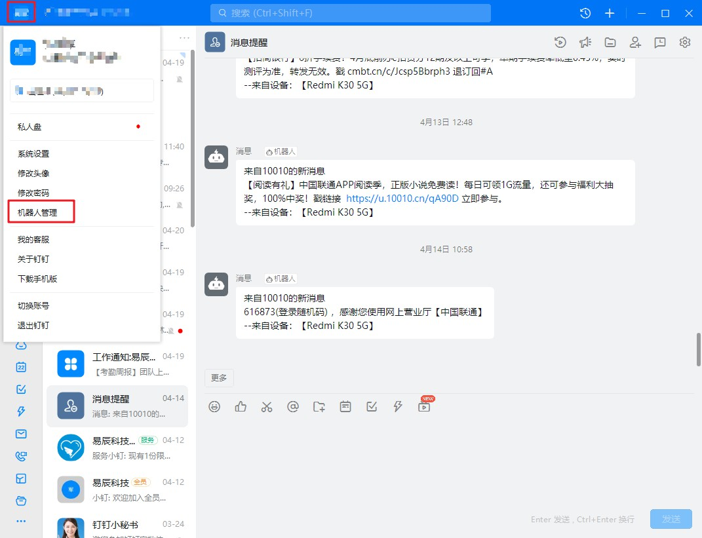
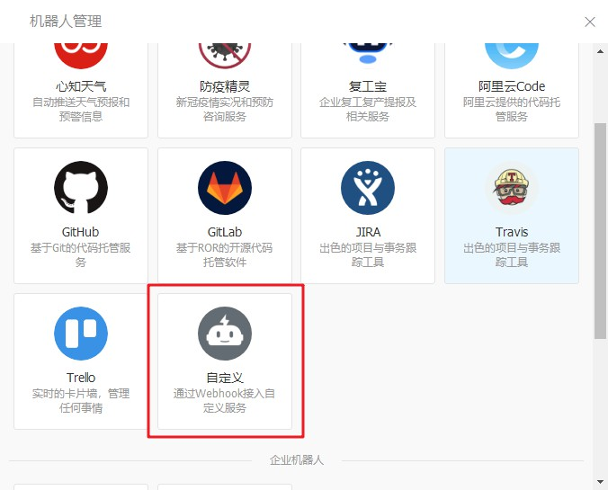
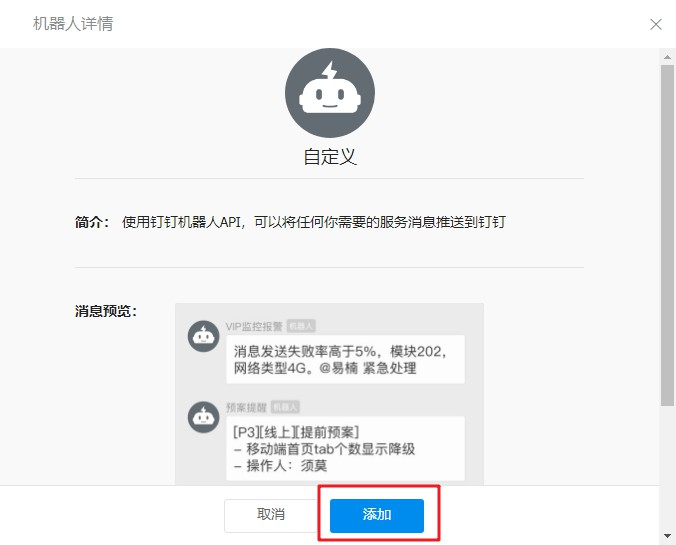
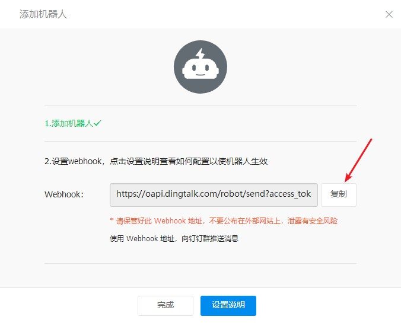
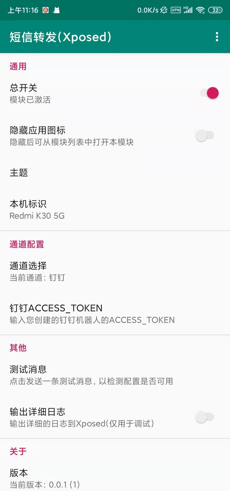

# 钉钉群机器人配置说明

## 流程

 1. 下载PC版钉钉、创建账号完成登录
 2. 创建机器人，获取access_token
 3. 配置通道

#### 第一步：下载PC版钉钉、创建账号完成登录

用电脑打开[钉钉官网](https://www.dingtalk.com/)，下载钉钉客户端，登录账号

#### 第二步：创建机器人
点击左上角头像,选择机器人管理

选择最后的自定义机器人

机器人详情信息点击添加按钮

输入您喜欢的机器人名字后添加到群组（随便建一个群），安全设置选择“自定义关键词”，关键词输入“来自” 点击完成

这时候会看到您的机器人webhook,点击复制（转发需要用到webhook里的access_token）
查看您刚刚复制的webhook,复制【access_token=】以后的内容（不包含access_token=）

#### 第三步：配置通道
通道选择【钉钉】，填入获取的access_token

