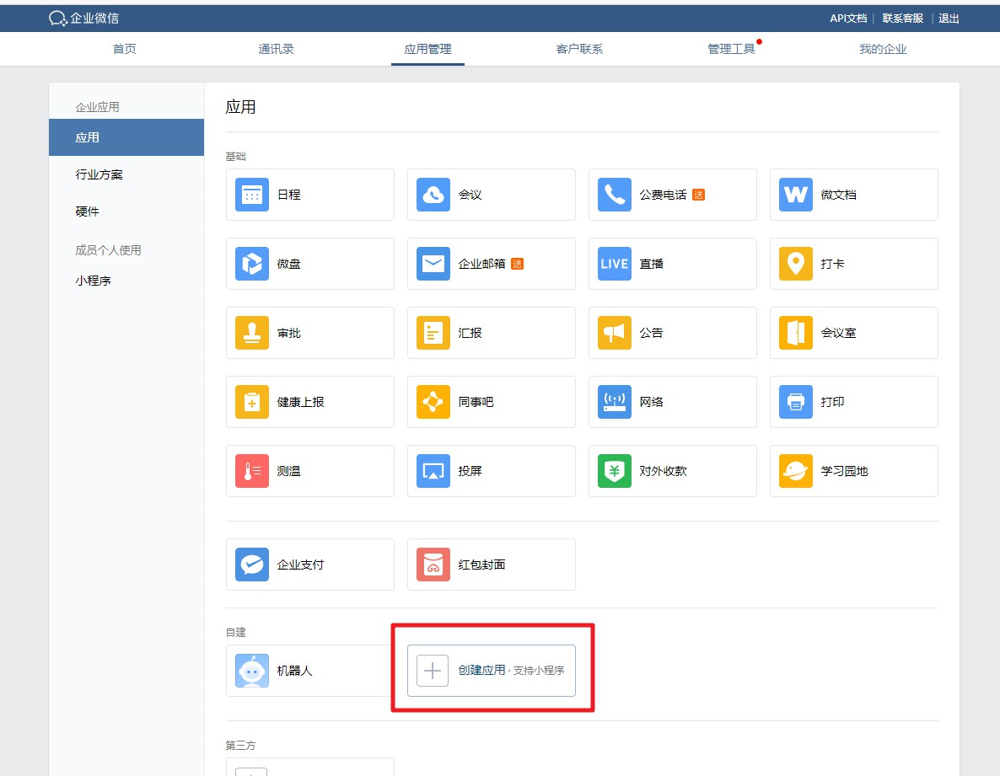
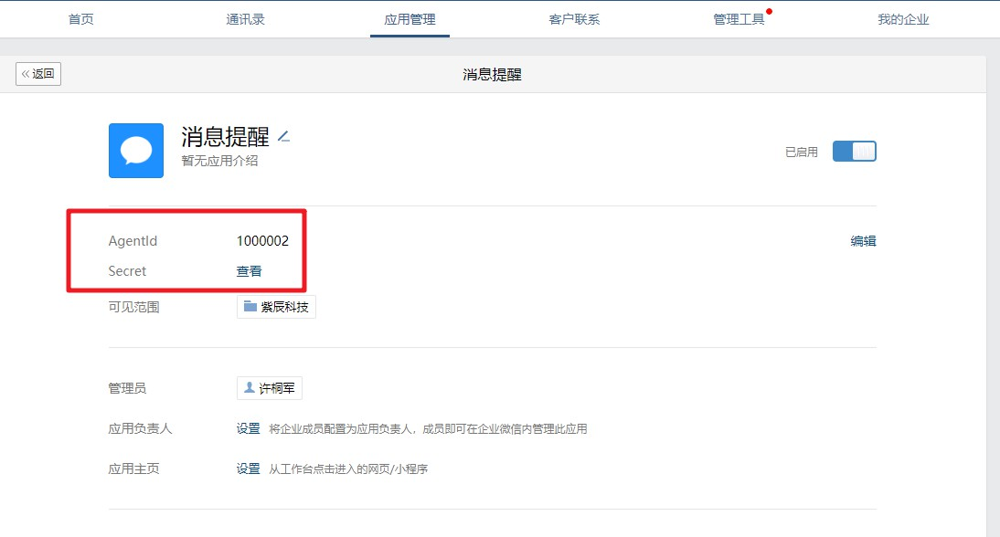
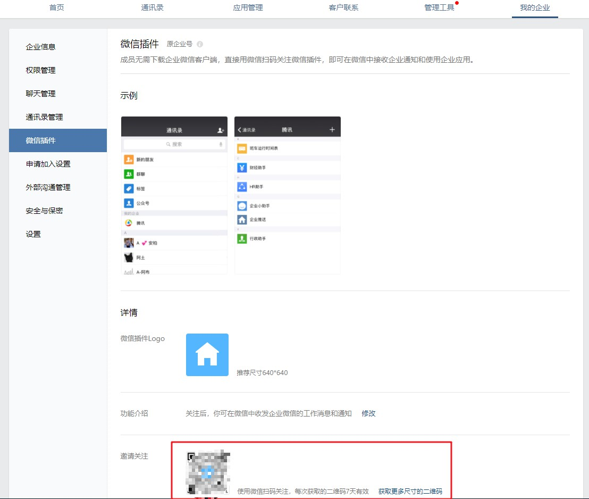

# 企业微信应用消息配置说明

## 流程

 1. 使用个人微信在企业微信注册一个企业，获取企业id
 2. 创建一个内部应用，获取应用agentId和应用Secret
 3. 开启微信插件
 4. 配置通道

#### 第一步，注册企业，获取企业id

用电脑打开[企业微信官网](https://work.weixin.qq.com/)，注册一个企业
注册完成后获取企业id

#### 第二步，创建应用
注册成功后，点【管理企业】进入管理界面，选择【应用管理】 → 【自建】 → 【创建应用】
应用名称、logo随便写，可见范围选择公司名。

创建完成后进入应用详情页，可以得到应用agentId，应用Secret

#### 第三步，关注微信插件
进入【我的企业】 → 【微信插件】，拉到下边扫描二维码，关注以后即可直接在个人微信收到推送的消息。

#### 第四步，配置通道
通道选择【企业微信消息】，依次填入企业id、应用agentId、应用Secret
推送UID保持默认

